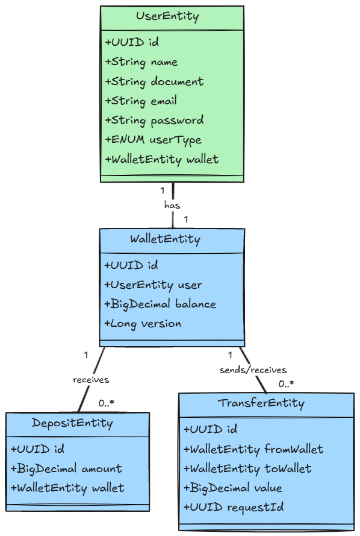

# Puxpay - Plataforma de Pagamentos

## Descrição
Puxpay é uma solução para gestão de usuários, carteiras digitais, transferências e depósitos. O sistema foi desenvolvido com **Micronaut 4.7.3**, utilizando práticas modernas de desenvolvimento, suporte a transações e integração com bancos de dados PostgreSQL.

---

## Diagrama


---

## Features

### Usuários
- Cadastro de usuários com validação de CPF e e-mail exclusivos.
- Associação automática de uma carteira digital ao criar um usuário.
- Suporte a dois tipos de usuários: comum e lojista.

### Carteiras Digitais
- Criação automática de carteira ao cadastrar um usuário.
- Consulta de saldos.
- Associação única entre carteira e usuário.

### Depósitos
- Realização de depósitos em carteiras digitais.
- Atualização automática do saldo da carteira após depósito.

### Transferências
- Transferências entre carteiras.
- Validação de saldo antes de realizar a transferência.
- Registro das transferências com origem e destino das carteiras.

---

## Casos de Uso

### Cadastro de Usuário
1. O usuário informa os dados: nome, CPF, e-mail, senha e tipo de usuário.
2. O sistema valida a únicidade do CPF e e-mail.
3. O usuário é criado e uma carteira é associada automaticamente.

### Realizar Depósito
1. O usuário informa o ID da carteira e o valor a ser depositado.
2. O sistema localiza a carteira e atualiza o saldo.
3. Um registro de depósito é criado para fins de auditoria.

### Transferência de Valores
1. O usuário informa as carteiras de origem e destino, junto com o valor.
2. O sistema valida se há saldo suficiente na carteira de origem.
3. O saldo das carteiras é atualizado e a transferência é registrada.

---

## Documentação do Projeto

### Referências do Micronaut
- [User Guide](https://docs.micronaut.io/4.7.3/guide/index.html)
- [API Reference](https://docs.micronaut.io/4.7.3/api/index.html)
- [Configuration Reference](https://docs.micronaut.io/4.7.3/guide/configurationreference.html)
- [Micronaut Guides](https://guides.micronaut.io/index.html)

### Plugins e Recursos

#### Validação
- [Micronaut Validation Documentation](https://micronaut-projects.github.io/micronaut-validation/latest/guide/)

#### OpenAPI e Swagger
- [Micronaut OpenAPI Support](https://micronaut-projects.github.io/micronaut-openapi/latest/guide/index.html)
- [Swagger UI](https://swagger.io/tools/swagger-ui/)

#### Banco de Dados e Migração
- [Micronaut Flyway](https://micronaut-projects.github.io/micronaut-flyway/latest/guide/index.html)
- [FlywayDB](https://flywaydb.org/)
- [Micronaut Hikari JDBC Connection Pool](https://micronaut-projects.github.io/micronaut-sql/latest/guide/index.html#jdbc)

#### Serialização
- [Micronaut Serialization Jackson Core](https://micronaut-projects.github.io/micronaut-serialization/latest/guide/)

#### Testes
- [Mockito](https://site.mockito.org)
- [Micronaut Test Resources](https://micronaut-projects.github.io/micronaut-test-resources/latest/guide/)

---

## Requisitos do Projeto
- **Java 21**
- **Micronaut 4.7.3**
- **PostgreSQL**
- **Maven**

---

## Como Executar
1. Clone o repositório:
   ```bash
   git clone <URL_DO_REPOSITORIO>
   ```
2. Navegue até o diretório do projeto:
   ```bash
   cd puxpay
   ```
3. Execute o projeto com o Maven:
   ```bash
   ./mvnw mn:run
   ```

---

## Licença
Este projeto é licenciado sob a [MIT License](https://opensource.org/licenses/MIT).

